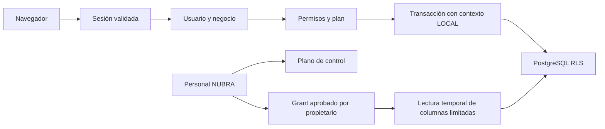

# Arquitectura de privacidad

Next.js App Router y Route Handlers utilizan una identidad de cuenta para onboarding y otra identidad de personal para administración. Un usuario aprobado obtiene un contexto empresarial derivado de sesión y membresía. No se aceptan IDs de cliente como prueba de autorización.

Las peticiones del negocio conservan filtros explícitos, claves compuestas y RLS. El plano de control permite autenticación, aprobación y facturación sin acceso ordinario al contenido empresarial. Sus tablas requieren controles de aplicación y permisos SQL; esta entrega no afirma aislamiento RLS universal de toda tabla administrativa.

Sesiones revocables, roles propios, separación de finanzas y exportación, grants auditados y archivos privados reducen accesos innecesarios. El soporte no exporta contenido ni modifica datos. No hay trackers de publicidad ni IA. Mercado Pago y SMTP solo se usan cuando se configuran; OCR se procesa en navegador con assets locales.

El cifrado envelope está preparado, pero los datos actuales no fueron convertidos. Un DBA, administrador de host o atacante con control del runtime sigue siendo una amenaza privilegiada. No se promete E2EE, conocimiento cero ni imposibilidad absoluta de acceso técnico.

La versión legal `2026-09-draft-2` describe los controles presentes y sus límites. Se conservan aceptaciones anteriores. Identidad jurídica, canales de contacto, proveedores, ubicaciones y retención definitivos continúan sujetos a revisión antes del lanzamiento comercial.
